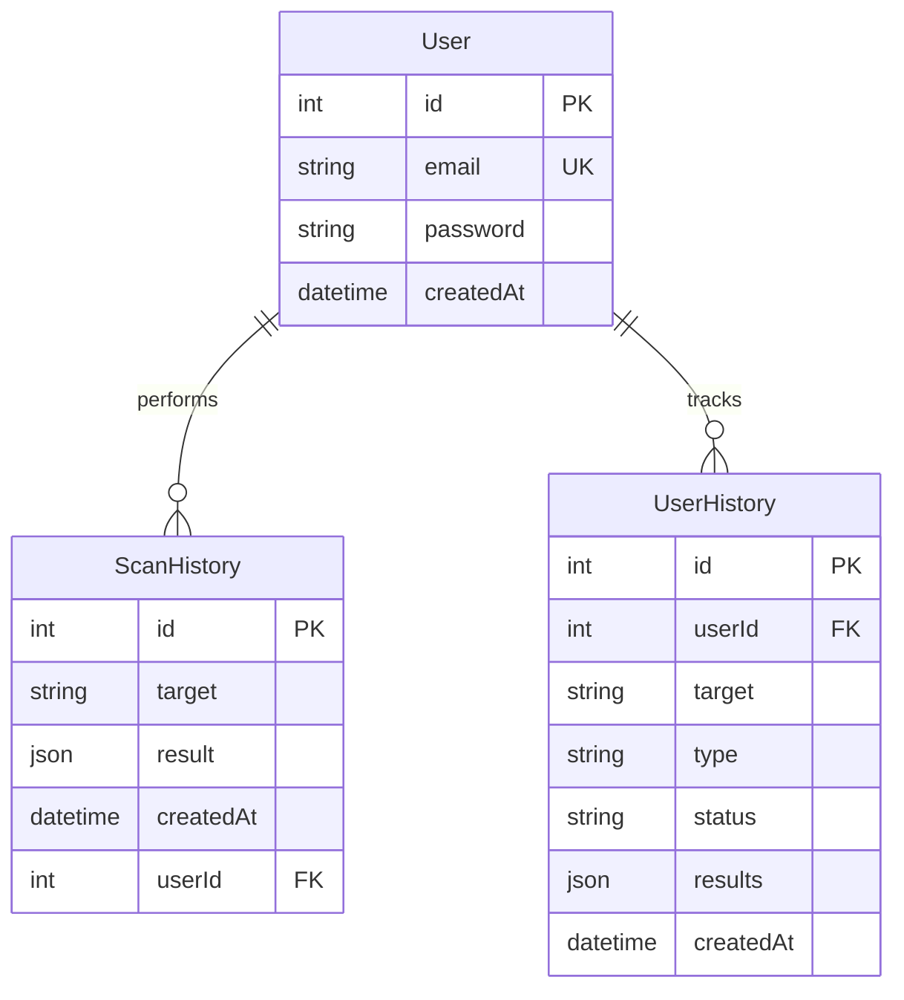

<div align="center">

</div>

<br/>
<b>DomainScope</b> brings together clarity, speed, and smart engineering into one smooth experience. It collects WHOIS data, DNS records, IP details, threat signals, hosting info, and metadata, all inside a clean and easy-to-use interface. Behind the scenes, it runs on distributed workers, fast caching, efficient data structures, reliable fallbacks, and full observability to keep everything fast, stable, and accurate. A modern and intelligent OSINT platform built for quick, hassle-free insights.

# 🎨 UI Showcase


# 🏗️ System Architecture
### High-Level Architecture
```text
┌─────────────────────────────────────────────────────────────────┐
│                     INTERNET BOUNDARY                            │
└────────────────────────┬────────────────────────────────────────┘
                         │
                    ┌────▼────┐
                    │   CDN   │ ← CloudFlare (DDoS Protection)
                    │ (Edge)  │
                    └────┬────┘
                         │
            ┌────────────▼─────────────┐
            │   Load Balancer (L7)     │ ← HAProxy/NGINX
            │  (Round Robin + Health)  │
            └────┬────────────┬────────┘
                 │            │
        ┌────────▼───┐   ┌───▼────────┐
        │  Frontend  │   │  Frontend  │ ← React SPA (Vite)
        │ Instance 1 │   │ Instance 2 │   Horizontally Scaled
        └────────┬───┘   └───┬────────┘
                 │            │
                 └─────┬──────┘
                       │ API Gateway
            ┌──────────▼──────────────┐
            │   API Gateway (v1)      │ ← Versioning + Rate Limit
            │   Express.js Backend    │
            └──┬────┬────┬────┬───┬──┘
               │    │    │    │   │
     ┌─────────▼┐ ┌─▼────▼──┐ │   │
     │ Auth     │ │ Scan    │ │   │
     │ Service  │ │ Service │ │   │
     └──────────┘ └─────────┘ │   │
                               │   │
        ┌──────────────────────▼───▼──────────┐
        │      Middleware Layer (Crosscut)     │
        ├──────────────────────────────────────┤
        │ • Circuit Breaker (Opossum)          │
        │ • Rate Limiter (Redis Token Bucket)  │
        │ • Metrics (Prometheus)                │
        │ • Tracing (OpenTelemetry)            │
        │ • API Versioning                      │
        └──┬────────────┬──────────────────┬───┘
           │            │                  │
    ┌──────▼─────┐ ┌───▼────────┐  ┌─────▼─────────┐
    │ PostgreSQL │ │   Redis    │  │   BullMQ      │
    │ (Primary)  │ │ (Cache +   │  │  (Job Queue)  │
    │            │ │  Sessions) │  │               │
    └────────────┘ └────────────┘  └───────────────┘
                        │
                ┌───────▼───────────────┐
                │  External APIs        │
                ├───────────────────────┤
                │ • VirusTotal          │
                │ • WHOIS Servers       │
                │ • ProxyCheck.io       │
                │ • DNSBL Providers     │
                │ • Google Safe Browse  │
                │ • URLScan.io          │
                │ • AlienVault OTX      │
                │ • Wayback Machine     │
                │ • IP2Location         │
                │ • Shodan Host Info    │
                └───────────────────────┘
```

### System Evolution

```text
Phase 1 (Monolith)        →  Phase 2 (Modular)       →  Phase 3 (Distributed)
├── dev-server.js         →  ├── backend/            →  ├── Microservices
├── In-memory cache       →  ├── Redis (single)      →  ├── Redis Cluster
├── Synchronous calls     →  ├── BullMQ             →  ├── Kafka Events
└── Basic JWT             →  └── API Keys           →  └── OAuth2 + mTLS

Performance:              →  Performance:            →  Performance:
• 50 RPS                  →  • 500 RPS              →  • 50,000 RPS
• 5s P99 latency          →  • 500ms P99            →  • 100ms P99
• Single instance         →  • 3 instances          →  • Auto-scaling
```

### Microservices Breakdown

```text
┌─────────────────────────────────────────────────────────┐
│                DomainScope Microservices                │
├─────────────────────────────────────────────────────────┤
│                                                         │
│  ┌──────────────┐  ┌──────────────┐  ┌─────────────┐  │
│  │ Auth Service │  │ Scan Service │  │ Webhook Svc │  │
│  ├──────────────┤  ├──────────────┤  ├─────────────┤  │
│  │ • JWT        │  │ • WHOIS      │  │ • HMAC Sign │  │
│  │ • API Keys   │  │ • DNSBL      │  │ • Retry Q   │  │
│  │ • Sessions   │  │ • VirusTotal │  │ • Fan-out   │  │
│  └──────────────┘  └──────────────┘  └─────────────┘  │
│                                                         │
│  ┌──────────────┐  ┌──────────────┐  ┌─────────────┐  │
│  │ History Svc  │  │ Queue Worker │  │ Metrics Svc │  │
│  ├──────────────┤  ├──────────────┤  ├─────────────┤  │
│  │ • CRUD       │  │ • BullMQ     │  │ • Prometheus│  │
│  │ • CSV Export │  │ • Retries    │  │ • OpenTel   │  │
│  │ • Analytics  │  │ • DLQ        │  │ • Grafana   │  │
│  └──────────────┘  └──────────────┘  └─────────────┘  │
│                                                         │
└─────────────────────────────────────────────────────────┘
```

### Database Schema



<br/>

✨ **Core pieces:**

* 🌐 Stateless API layer
* ⚡ Redis caching layer
* 📬 BullMQ worker pipeline
* 🗄️ PostgreSQL for durable storage
* 🔌 Circuit breakers for external API protection
* 📡 Observability baked in

# 💡 What Makes DomainScope Different

### 🟦 Friendly on the surface, engineered underneath

The UI is calm and clean — but the backend runs like real infrastructure.

### ⚡ Built for speed

Bloom Filters, caching layers, worker queues — everything is optimized.

### 🛡️ Failure‑resistant

Circuit breakers and fallbacks keep uptime smooth.

### 🧠 More than raw information

The output is structured, readable, and actionable.

### 🧵 Parallel from the start

Heavy work runs across worker pools, keeping responses instant.

# 💬 How the System Works (Story Style)

When a user enters **example.com**, here's the journey:

1. 🛂 **Gateway check** — Accept the request and verify rate limits.
2. 🧠 **Bloom Filter** — Quick “have we seen this before?” lookup.
3. ⚡ **Redis** — Instant result if cached.
4. 📬 **Queue** — If new, the domain is pushed to background workers.
5. 🏗️ **Workers** — Fetch WHOIS, DNS, IP, threat intel, metadata.
6. 🔌 **Circuit Breaker** — Protects the system from failing upstreams.
7. 💾 **Database + Cache** — Results stored for reuse.
8. 🎨 **UI** — Displays a clean, friendly summary.

A smooth, fast, and scalable journey end‑to‑end.

# ✨ Feature Deep Dive

### 📦 Bulk Scanning Engine
Process hundreds of domains in parallel. Simply paste a list of domains, and DomainScope's distributed workers will fetch intelligence for all of them simultaneously.
*   **Real-time tracking:** Watch progress as each domain is analyzed.
*   **CSV Export:** Download full datasets including domain age, registrar, and threat scores.
*   **Smart Logging:** Automatically tracks failed lookups for retry.

### 🗂️ Smart History & Management
Never lose track of your investigations. Every scan is automatically saved to your secure history.
*   **Auto-Save:** Instant persistence of all scan results.
*   **One-Click Export:** Download your entire history as a CSV report.
*   **Easy Management:** View, search, or clear your history with a simple UI.

### 🛡️ Advanced Threat Intelligence
Going beyond basic WHOIS, DomainScope integrates multiple top-tier security engines:
*   **IPInfo, ProxyCheck.io & AbuseIPDB:** Real-time fraud scores and abuse reporting.
*   **VPN/Proxy/Tor Detection:** Instantly identify anonymous infrastructure.
*   **DNSBL Checks:** Cross-reference IPs against Spamhaus, SpamCop, SORBS, and Barracuda.

### 🔍 Subdomain Discovery
Automatically discover subdomains associated with any target domain:
*   **Certificate Transparency Logs:** Uses crt.sh API to find all subdomains with SSL certificates.
*   **Smart Caching:** 24-hour Redis caching respects rate limits and improves performance.
*   **Premium UI:** Clean, modern interface with direct links to each subdomain.

### ⚙️ Customizable Module Selection
Choose exactly which intelligence modules to run and display:
*   **Granular Control:** Toggle Core Analysis, Security Intel, Subdomains, VirusTotal, and Metadata individually.
*   **API Optimization:** Disabled modules are not fetched, saving API quota and improving speed.
*   **Flexible Workflows:** Customize scans based on your specific investigation needs.

### 🌗 Adaptive UI
Designed for any environment.
*   **Dark/Light Mode:** Seamlessly switches based on system preference or user toggle.
*   **Responsive Design:** Perfect experience on desktop, tablet, or mobile.

# 🧩 Production-Ready Engineering

Below are the core engineering systems, rewritten into friendly, simple, emoji‑enhanced mini‑paragraphs that feel alive and easy to read.

🔌 **Resilient External Service Handling**
DomainScope remains steady even when external APIs slow down or fail. A smart circuit breaker detects issues early, switches to a safe fail‑fast mode, and gradually recovers through a half‑open phase — preventing cascading failures. ⛑️

⚡ **High‑Impact Caching Architecture**
Caching plays a central role in performance. Redis handles lazy reads, write‑through updates, TTL jittering, and negative caching. These techniques improve speed, reduce API usage, and lower system load. 🔥⏱️

🔄 **Asynchronous & Parallel Processing**
Workloads stay smooth thanks to a queue‑driven pipeline. Tasks are enqueued, processed by workers in parallel, retried when needed, and sent to a DLQ if they repeatedly fail. This keeps the UI responsive and operations reliable. 🌀⚙️

🧮 **Smart Data Structures**
Efficient data structures give DomainScope a real edge. A Trie speeds up blocklist and subdomain checks, while a Bloom Filter enables instant membership tests. These save time, memory, and upstream requests. 🌲🌸💡

📊 **Stable Performance Under Load**
Even during traffic spikes, DomainScope stays fast and predictable. High cache hit rates, consistent P95 latency, and autoscaling workers ensure a smooth experience. ⚡📈🤖

📈 **Horizontal Scaling Strategy**
Growth is handled gracefully. Multi‑node backend instances, a Redis cluster, PostgreSQL read replicas, and autoscaling workers let the system expand without friction. 🚀🌐🗄️🤖

# 🛡️ Security Architecture

DomainScope follows a layered security approach designed to keep every request safe and every workflow trustworthy. 🛡️✨ It uses smart protective layers like CDN filtering, strict rate limits, secure authentication, and clean input validation — all supported by detailed audit logs. Together, these guard against SQL injection, XSS, CSRF, DDoS, API misuse, and other real‑world threats.

### 🚦 Advanced Rate Limiting & Anti-Flooding
We implement a dual-layer rate limiting strategy to balance user experience with strict security:

*   **Global Flood Protection:**
    *   **Limit:** 100 requests per 15 minutes per IP.
    *   **Purpose:** Prevents DDoS attacks and general API abuse.
    *   **Mechanism:** Token bucket algorithm using Redis/Memory.

*   **Strict Auth Protection:**
    *   **Limit:** 10 requests per 1 hour per IP.
    *   **Purpose:** Specifically targets brute-force password guessing and SMS/Email flooding.
    *   **Scope:** Applies to Login, Signup, OTP, and Password Reset endpoints.
    *   **Privacy:** IP tracking is **in-memory only** and is NOT stored in the permanent database.

### 🔐 Core Security Features
*   **CDN & Headers:** CloudFlare protection + Helmet for secure HTTP headers.
*   **Authentication:** JWT sessions, bcrypt password hashing, and API keys.
*   **Anti-Enumeration:** Login and Forgot Password endpoints return generic responses to prevent user harvesting.
*   **Input Hygiene:** Zod validation, HPP (Parameter Pollution) protection, and Body Size limiting (10kb).
*   **Audit Logging:** Tracks important actions for security review.

# 🔭 Observability & SRE

DomainScope is fully observable — you can understand what's happening, where it's happening, and why it's happening. 🔍🌈 With rich tracing, real‑time metrics, clean dashboards, and SLO tracking, the system stays predictable, debuggable, and safe to evolve.

* 🛰️ OpenTelemetry tracing gives end‑to‑end visibility.
* 📊 Prometheus collects meaningful metrics.
* 📈 Grafana dashboards visualize trends.
* 🧾 Structured logs keep debugging clear.
* 🎯 SLOs + error budgets guide stability.

# 📦 Intelligence Output

Every scan produces clean, structured, and insightful domain intelligence — crafted for analysts, researchers, and automated pipelines. 📦✨ The results are easy to understand, nicely formatted, and ready to export.

* 🪪 **WHOIS details:** Registrar, dates, and contact info.
* 🌐 **DNS records:** A, AAAA, MX, NS, TXT, CNAME, SOA, CAA, and PTR (Reverse DNS).
* 📧 **Email Security:** SPF, DKIM, DMARC, BIMI validation with deliverability scoring.
* 🔒 **SSL/TLS Analysis:** Certificate details, chain validation, security grading, expiry warnings.
* 🛡️ **HTTP Security:** HSTS, CSP, X-Frame-Options, and comprehensive header analysis.
* 📜 **Passive DNS:** Historical IP resolutions and domain associations.
* 🔍 **Subdomain Discovery:** All subdomains found via Certificate Transparency logs.
* 🛰️ **IP & ASN data:** Geolocation, ISP, and organization details.
* 🔥 **Threat Intelligence:** Real-time checks via VirusTotal, Google Safe Browsing, URLScan.io, AlienVault OTX.
* 🕰️ **Historical Data:** Wayback Machine snapshots showing domain evolution over time.
* 🛡️ **Security Signals:** VPN/Proxy/Tor detection and DNSBL status.
* 🏷️ **Domain metadata:** Tech stack, hosting info, and site description.
* 📤 **Bulk exports:** Full CSV reports for larger workflows.

Clear, actionable, and beautifully organized.

# ⚔️ Comparison Table

Here is an improved, clean, and accurate comparison table—benchmarking DomainScope against real OSINT tools like **WhoisXML**, **ViewDNS**, **DNSDumpster**, and **IPInfo**.

| Feature                  | Typical Tools (WhoisXML, ViewDNS, DNSDumpster) | **DomainScope**                                         |
| ------------------------ | ---------------------------------------------- | ------------------------------------------------------- |
| 🪪 **WHOIS Data**        | ✔️ Basic lookup                                | ✔️ Structured, enriched, historical snapshots           |
| 🌐 **DNS Records**       | ✔️ Basic A / NS / MX                           | ✔️ Complete: A, AAAA, MX, NS, TXT, CNAME, SOA, CAA, PTR |
| 📧 **Email Security**    | ❌ Not included                                | ✔️ SPF, DKIM, DMARC, BIMI with scoring                  |
| 🔒 **SSL/TLS Analysis**  | ❌ Not included                                | ✔️ Certificate validation, chain, security grading      |
| 🛡️ **Security Headers**  | ❌ Not included                                | ✔️ HSTS, CSP, and 10+ header checks                    |
| 🔥 **Threat Checks**     | ❌ Often missing                                | ✔️ 6+ threat intel sources (VT, Google, URLScan, OTX)  |
| 🕰️ **Historical Data**   | ❌ Limited/paid                                | ✔️ Wayback Machine + Passive DNS                        |
| 🏷️ **Metadata**         | ❌ Rarely included                              | ✔️ Hosting info, categories, tech stack, tags           |
| 📤 **Bulk Scanning**     | ❌ Limited / paid                               | ✔️ Fast, parallel, included                             |
| 🎨 **UI & UX**           | ❌ Outdated, cluttered                          | ⭐ Modern, responsive, user‑friendly                     |
| 🧠 **Engineering Depth** | ❌ Minimal infra                                | ⭐ Caching layer, DS, async workers, resilience patterns |
| 🛡️ **Reliability**      | ❌ API failures disrupt workflow                | ⭐ Circuit breakers, graceful fallbacks                  |
| ⚡ **Performance**        | ❌ Sequential + slow                            | ⭐ Parallel processing, caching, queuing                 |
| 📈 **Scalability**       | ❌ Single‑server, limited                       | ⭐ Horizontal scaling ready                              |
| 📊 **Observability**     | ❌ Basic logs only                              | ⭐ Tracing, dashboards, metrics, error budgets           |

# 🏆 Project Strength Summary

DomainScope is built with the principles found in large‑scale, real‑world systems.

### Highlights:

* ⚡ **Scale:** Built to handle millions of requests.
* 🛡️ **Reliability:** Graceful fallbacks + circuit breakers.
* 🚀 **Performance:** Low latency + high cache hit rate.
* 🏗️ **Architecture:** Distributed, event‑driven, horizontally scalable.
* 👁️ **Observability:** Tracing, metrics, and SLO practices.
* 🔐 **Security:** Strong authentication + validation layers.
* 🧩 **Quality:** Typed TypeScript + modular structure.
* 📈 **SRE:** Error budgets + automated recovery.

# 🤝 Contribute

Your contributions help shape and strengthen DomainScope. Whether it's polishing the UI, adding new types of intelligence, boosting performance, or improving system resilience, every improvement makes a real impact. 💛

Here are a few meaningful ways you can contribute:

✨ **Enhance the interface** – Improve visuals, workflows, or usability.

🧠 **Integrate new intelligence sources** – Expand the depth of domain insights.

⚡ **Optimize performance** – Speed up systems, caching, or worker processes.

🛠️ **Increase reliability** – Strengthen fallbacks, durability, and automation.

🐞 **Fix issues & bugs** – Help keep everything smooth and stable.

Your ideas, discussions, and pull requests are always welcome. Let's build something powerful together. 🚀
