# System Architecture

## 1. High-Level Overview

DomainScope is designed as a **modular monolith** evolving into a **microservices** architecture. It separates concerns between the frontend user interface, the API gateway/backend logic, and background worker processes for heavy data lifting. This ensures the user interface remains responsive while complex data aggregation happens asynchronously.

## 2. Architectural Diagram

```mermaid
graph TD
    %% Styles
    classDef client fill:#f9f,stroke:#333,stroke-width:2px,color:black;
    classDef edge fill:#e1f5fe,stroke:#0277bd,stroke-width:2px,color:black;
    classDef app fill:#e8f5e9,stroke:#2e7d32,stroke-width:2px,color:black;
    classDef data fill:#fff3e0,stroke:#ef6c00,stroke-width:2px,color:black;
    classDef ext fill:#f3e5f5,stroke:#7b1fa2,stroke-width:2px,color:black;

    subgraph User_Access ["👤 Client Layer"]
        direction TB
        Browser["🖥️ User Browser<br/>(React SPA)"]:::client
    end

    subgraph Security_Edge ["🛡️ Security & Edge Layer"]
        direction TB
        CDN["☁️ CDN / WAF<br/>(DDoS Protection)"]:::edge
        LB["⚖️ Load Balancer<br/>(NGINX)"]:::edge
    end

    subgraph App_Core ["⚙️ Application Core"]
        direction TB
        API["🚀 API Gateway<br/>(Node.js/Express)"]:::app
        Worker["👷 Background Workers<br/>(BullMQ Processors)"]:::app
    end

    subgraph Data_Persistence ["💾 Data & State"]
        direction TB
        Redis[("⚡ Redis Cluster<br/>(Cache & Queue)")]:::data
        DB[("🐘 PostgreSQL<br/>(Primary DB)")]:::data
    end

    subgraph External_World ["🌐 External Intelligence"]
        direction TB
        VT["🦠 VirusTotal API"]:::ext
        WHOIS["📜 WHOIS Servers"]:::ext
        IPInfo["🕵️ IPInfo"]:::ext
        IP2Loc["📍 IP2Location"]:::ext
        DNS["🗺️ DNS Resolvers"]:::ext
        CRT["🔍 crt.sh (Subdomains)"]:::ext
        HT["🎯 HackerTarget"]:::ext
        PC["🛡️ ProxyCheck.io"]:::ext
        GSB["🚫 Google Safe Browsing"]:::ext
        URLS["📸 URLScan.io"]:::ext
        OTX["👽 AlienVault OTX"]:::ext
        WB["🕰️ Wayback Machine"]:::ext
        ABUSE["🚫 AbuseIPDB"]:::ext
    end

    %% Connections
    Browser -->|HTTPS/TLS 1.3| CDN
    CDN -->|Filtered Traffic| LB
    LB -->|Reverse Proxy| API
    
    API -->|Read/Write| DB
    API -->|Cache Hit/Miss| Redis
    API -.->|Async Job| Redis
    
    Redis -.->|Job Event| Worker
    
    Worker -->|Fetch| VT
    Worker -->|Query| WHOIS
    Worker -->|Analyze| IPInfo
    Worker -->|Resolve| DNS
    Worker -->|Discover| CRT
    Worker -->|Verify| PC
    Worker -->|Check| GSB
    Worker -->|Scan| URLS
    Worker -->|Intel| OTX
    Worker -->|History| WB
    Worker -->|Check| ABUSE
    
    Worker -->|Persist Result| DB
    Worker -->|Update Cache| Redis
```

## 3. Component Description

### 3.1. Frontend (Presentation Layer)
*   **Technology**: React.js, Vite, TailwindCSS.
*   **Responsibility**: Renders the UI, handles user interactions, visualizes data (charts, graphs), and communicates with the backend via REST APIs.
*   **Hosting**: Served as static assets via NGINX or a CDN.

### 3.2. Backend API (Application Layer)
*   **Technology**: Node.js, Express.js, TypeScript.
*   **Responsibility**:
    *   **Authentication**: Manages user sessions (JWT), login, and signup.
    *   **API Gateway**: Validates requests, enforces rate limits, and routes traffic.
    *   **Orchestration**: Dispatches scan requests to the job queue.
    *   **Data Access**: Retrieves stored scan history and user data from PostgreSQL.

### 3.3. Background Workers (Processing Layer)
*   **Technology**: Node.js, BullMQ (Redis-based queues).
*   **Responsibility**:
    *   Executes long-running tasks asynchronously.
    *   Fetches data from multiple external sources (WHOIS, DNS, Threat Intel, ProxyCheck, IP2Location, Subdomains, HackerTarget, Safe Browsing, OTX) in parallel.
    *   Aggregates results and updates the database.
    *   Handles retries and failures (Dead Letter Queues).

### 3.4. Data Storage
*   **PostgreSQL**: Primary source of truth. Stores user accounts, persistent scan history, and audit logs.
*   **Redis**: High-performance in-memory store. Used for:
    *   **Caching**: Storing frequent scan results to reduce API costs and latency.
    *   **Queues**: Managing background job distribution.
    *   **Rate Limiting**: Tracking request counts per IP/User.
    *   **Session Store**: Managing active user sessions.

## 4. Design Principles

*   **Statelessness**: Application servers do not store local state, allowing for easy horizontal scaling.
*   **Asynchronous Processing**: Heavy operations are offloaded to background workers to prevent blocking the main thread.
*   **Fail-Safe**: Circuit breakers (Opossum) prevent cascading failures when external APIs are down.
*   **Security First**: Input validation (Zod), output sanitization, and strict access controls are applied at every layer.

## 5. Sequence Diagram (Scan Flow)

This diagram illustrates the asynchronous flow of a domain scan request, from the user's browser to the background workers and back.

## 6. Database Schema (ER Diagram)

The following Entity-Relationship diagram represents the core data models used in PostgreSQL.

